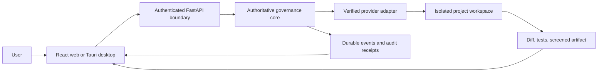

# Corvus

<p align="center">
  
</p>

<p align="center">
  <a href="https://github.com/aGamingGod1234/corvus-platform/actions/workflows/certification.yml"></a>
  <a href="https://github.com/aGamingGod1234/corvus-platform/actions/workflows/security-scan.yml"></a>
  <a href="https://github.com/aGamingGod1234/corvus-platform/releases"></a>
</p>

**Corvus is a local-first, proof-carrying AI agent workspace.** It lets an agent complete real coding work inside an isolated project workspace, then returns the diff, test evidence, safety receipt, and screened artifact for human review.

One authoritative Python core powers the CLI, FastAPI service, React client, and Tauri desktop shell. Shipped local paths reuse the same authorization, credential-reference, audit, and sandbox services; durable budget and kill-switch repositories remain explicit roadmap work.

## Evaluate Corvus in 90 seconds

1. Launch the desktop app and select a real project.
2. Choose an authenticated local provider, model, thinking level, and **Build** mode.
3. Ask Corvus to make a small change and watch safe progress stream in real time.
4. Review the changed files, test result, activity summary, and detailed safety receipt.
5. Export the screened ZIP or explicitly prepare a GitHub branch and pull request.

The rehearsable sub-three-minute journey is in [`docs/demo/BUILD_WEEK_DEMO.md`](docs/demo/BUILD_WEEK_DEMO.md). Verified commands and honest limitations are recorded in [`HACKATHON_STATUS.md`](HACKATHON_STATUS.md).

## What makes Corvus different

| Typical agent risk | Corvus approach |
| --- | --- |
| Work happens in an opaque environment | Every Build produces reviewable activity, evidence, and a terminal safety receipt |
| The agent edits the original checkout | Coding runs use a Corvus-owned isolated workspace pinned to the selected project |
| Permissions silently expand | Server-authored policy binds provider, model, filesystem, network, MCP, approval, and runtime choices |
| A successful-looking message is treated as proof | Completion is tied to observed changes, verification evidence, artifact screening, and hashes |
| One developer-shaped interface serves everyone | Everyday/Developer and Individual/Team profiles adapt language and navigation without changing authority |

Corvus never merges, force-pushes, transfers imported permissions, or lets a schedule publish code. Unsupported Cloud, billing, and provider paths remain visibly labeled **Preview** or unavailable.

## Capability status

| Capability | Status |
| --- | --- |
| Local Codex/Claude Chat and protected Build runs | **Working** |
| Streaming status, model controls, MCP consent, safety receipts, and artifact export | **Working** |
| Local projects, GitHub-assisted review flow, reviewed skills, and supervised schedules | **Working** |
| Everyday/Developer and Individual/Team-adapted application shell | **Working**; real multi-user Team authority is Preview |
| Google-backed hosted identity and device-continuity foundation | **Preview**; deployment configuration and production persistence required |
| E2B-backed Corvus Cloud execution | **Preview** — tracked in [#17](https://github.com/aGamingGod1234/corvus-platform/issues/17) |
| Production cross-device sync and team collaboration | **Roadmap** — tracked in [#18](https://github.com/aGamingGod1234/corvus-platform/issues/18) and [#19](https://github.com/aGamingGod1234/corvus-platform/issues/19) |
| Signed installers and secure automatic updates | **Roadmap** — tracked in [#20](https://github.com/aGamingGod1234/corvus-platform/issues/20) |

## Architecture at a glance



## A workspace that fits the user

Corvus adapts its language and navigation without creating separate products or separate security rules.

| Work style | Personal workspace | Team workspace preview |
| --- | --- | --- |
| Everyday | Home, My Work, Automations, Files | Team Home, Assigned Work, Approvals, Knowledge, People |
| Developer | Repositories, Threads, Changes, Runs, Skills | Repositories, Work Queue, Reviews, Environments, Policies |

The Team profile currently previews the shared-work information architecture. It does not manufacture members, permissions, or authority before the real collaboration capability is connected.

## Choose where Corvus runs

- **On this computer:** operational today. The desktop app supervises the same-machine sidecar, and the browser client can connect to the same local service.
- **Corvus Cloud (E2B):** clearly labeled **Preview**. The current build does not create a cloud sandbox, perform Google sign-in, collect payment, or imply that those paths are available.

Local and future Cloud runtimes share contracts; clients never grant themselves workspace authority.

## What works today

- Durable outcomes, dependency-linked workflows, attempts, leases, checkpoints, artifacts, lineage, conversations, and resumable event streams.
- One-time approvals, deterministic effect idempotency, budget reservation and settlement, kill switches, and restart recovery.
- Connected CLI, FastAPI, generated TypeScript client, React web app, and Tauri Windows shell over the same application services.
- Local/demo collaboration, governed memory, versioned skills and routines, signed offline intents, and signed channel ingress.
- Real local repository registration and GitHub status through fixed-argument Git and `gh` adapters that never store a GitHub token.
- Durable Codex runs in managed Git worktrees, with reviewable diffs, bounded evidence, real secret scanning, cancellation, retry, recovery, and explicit discard.
- Confirmed branch, commit, push, and draft/ready pull-request publication without merge, force-push, or repository-administration authority.
- Reviewed cross-agent skill import from Codex, Claude Code, Hermes, Copilot, and portable Agent Skills locations, with immutable versions and quarantine scanning.
- Timezone-aware local schedules that create ordinary supervised runs and stop code-changing output before push or pull-request creation.
- Optional tray/background operation, launch at login, and redacted native run notifications in the installed desktop app.
- Adaptive Everyday/Developer and Personal/Team workspace profiles with responsive desktop and mobile navigation.
- A security-focused agent-runtime foundation with immutable requests, provider-binding digests, verified authority receipts, bounded autonomy proofs, fail-closed capability discovery, redacted hash-chained events, replay resistance, and explicit audit-pending results.
- A chat-first local agent workspace with on-demand history, provider/model/thinking controls, safe streamed reasoning summaries and work status, explicit MCP opt-in, and downloadable project artifacts.
- Server-authored safety previews bind every Build confirmation to the exact runtime policy digest; completed builds return an owner-scoped safety receipt with observed activity, artifact hash, and screening result.
- Owner-scoped runtime preferences for provider, model, thinking, Chat/Build mode, MCP consent, response style, and custom rules, persisted by the authenticated local backend with optimistic version checks.
- Secure bring-your-own-key Chat adapters for OpenAI, Anthropic, Gemini, and xAI, with write-only keyring storage, environment fallback, authenticated verification/model discovery, and no secret returned to the client.

Local Codex and Claude run through native CLIs detected on the device; the provider verifies its own sign-in when a run starts. Chat is read-only. Codex Build mode uses a fresh workspace-write sandbox, always disables user plugins/apps/hooks, enables MCP only after explicit consent, streams only safe summaries/status, and returns a bounded ZIP with a SHA-256 manifest. Network behavior follows the selected CLI sandbox policy; Corvus grants no separate network permission. API-key providers are deliberately Chat-only: prompts go directly to the selected provider over HTTPS, with no project filesystem, MCP, or sandbox claim. Keys live only in the operating-system keyring or provider environment variable and are never returned, logged, synchronized, placed in prompts, or included in artifacts/audit output. Cursor remains unavailable until a real adapter exists.

## Codex Usage

OpenAI Codex was used as the primary engineering agent for planning, implementation, code review remediation, security hardening, cross-platform CI repair, and end-to-end verification. Corvus also integrates the user's installed Codex CLI as a local runtime: the user can select recommended GPT-5.6 models and thinking levels, stream safe progress, opt into MCP tools, and run a coding task inside the bounded Build workspace before downloading the result.

The final Devpost recording should capture the Codex `/feedback` session ID alongside the sub-three-minute demo. That ID is intentionally not fabricated or committed in advance.

Key Codex-assisted safeguards include fixed-argument process invocation, provider-bound model validation, explicit MCP consent, plugin/app/hook isolation, secret-screened artifact packaging, signed cursors, reconnect-safe event replay, and fail-closed provider discovery.

## Quick start

Requirements:

- Python 3.12
- `uv`
- Node.js and `pnpm`
- Rust/Cargo only when building the desktop shell

Install and build from PowerShell:

```powershell
uv sync --all-groups --locked
pnpm --dir apps/web install --frozen-lockfile
pnpm --dir apps/web build
```

Start the same-machine API and compiled web client:

```powershell
$env:CORVUS_BOOTSTRAP_TOKEN = '<one-time-pairing-value>'
$env:CORVUS_SESSION_SECRET = '<at-least-32-byte-signing-value>'
uv run corvus-mvp server --database corvus-mvp.sqlite3 --static-web-dir apps/web/dist
```

Then open the loopback URL printed by the server, normally `http://127.0.0.1:8080`, and pair once. A durable CLI-only demo is also available:

```powershell
uv run corvus-mvp demo --database corvus-mvp.sqlite3 --json
uv run corvus-mvp capabilities-demo --database corvus-mvp.sqlite3 --json
```

Build and run the Windows desktop shell:

```powershell
$env:PATH = "C:\Users\lucas\.cargo\bin;$env:PATH"
$env:CORVUS_SIDECAR_EXECUTABLE = (Resolve-Path .venv\Scripts\corvus-mvp.exe).Path
pnpm --dir apps/desktop install --frozen-lockfile
pnpm --dir apps/desktop tauri build --no-bundle
& apps\desktop\src-tauri\target\release\corvus-desktop.exe
```

## Hackathon release installers and web deployment

The release workflow produces unsigned x64 desktop installers from one reviewed commit. Published artifacts appear on the [GitHub Releases page](https://github.com/aGamingGod1234/corvus-platform/releases) only after the corresponding version tag points to a commit on `main`:

- Windows x64: NSIS installer
- macOS Intel x64: DMG
- Linux x64: AppImage and Debian package
- Cross-platform verification: `SHA256SUMS.txt`

The workflow builds a standalone `corvus-mvp` sidecar with PyInstaller 6.21.0 and packages it with the Tauri shell only when manually dispatched or when a version tag is pushed. Pull requests do not execute release packaging. A published, non-draft GitHub prerelease is created only when the tag points to a commit already on `main`. Download the installers and `SHA256SUMS.txt` into the same directory, then run `sha256sum -c SHA256SUMS.txt`; the manifest uses portable filenames rather than workflow-internal paths.

These installers are intentionally unsigned beta artifacts. Windows may show SmartScreen warnings, macOS Gatekeeper will treat the DMG as unnotarized, and Linux users may need to mark the AppImage executable. Production signing, notarization, auto-update signing, and stable release channels remain later work.

The web app is linked to Vercel project `corvus-platform`, connected to `aGamingGod1234/corvus-platform`, with Git root `apps/web` so `main` updates produce production deployments and pull requests produce previews. Current deployment: <https://corvus-platform-tau.vercel.app>. The hosted app keeps Local mode honest: it hands off to the same-machine local runtime and does not receive local pairing secrets or session cookies.

## Development and verification

```powershell
uv run pytest -q
uv run ruff check .
uv run ruff format --check .
pnpm --dir apps/web test
pnpm --dir apps/web build
& "$HOME\.cargo\bin\cargo.exe" check --manifest-path apps/desktop/src-tauri/Cargo.toml
```

Corvus build execution is fail-closed. Production sandbox images must be digest-pinned, and unavailable container isolation never falls back to privileged host execution. The supported default image is:

```text
python:3.12-slim@sha256:423ed6ab25b1921a477529254bfeeabf5855151dc2c3141699a1bfc852199fbf
```

### GitHub CLI binary provenance

The alpha installers do not bundle GitHub CLI (`gh`) or Git. GitHub-backed project actions therefore require trusted, host-installed copies from the official GitHub CLI and Git distribution channels. Corvus resolves each executable to an absolute regular-file path, rejects link or reparse-point executables, launches `gh` directly without a shell, strips the inherited `PATH`, and prepends only the validated Git executable directory needed by `gh repo clone`. GitHub CLI owns its machine-local authentication token; Corvus neither imports global `gh` configuration into its isolated state nor stores that token itself.

This is an explicit supply-chain trust boundary: release builders and demo operators must install `gh` and Git from signed or checksum-verified vendor packages and must not place attacker-writable directories or replacement binaries ahead of those installations.

## Status and scope

This repository contains the preserved M0.5-M11 hackathon MVP foundation plus the adaptive application shell, Google-backed hosted identity/synchronization foundation, native Codex/Claude execution, and secure API Chat adapters. It is not formal certification. Real E2B lifecycle management, Cursor and API-provider Build adapters, durable provider/autonomy/budget/kill repositories, and production signing remain explicit later milestones.

See [HACKATHON_STATUS.md](HACKATHON_STATUS.md) for verified commands and limitations, [ROADMAP.md](ROADMAP.md) for the readable delivery outline, and [PLAN.md](PLAN.md) for the authoritative security specification.

Changes target `main` through ready pull requests. Review findings are fixed on the feature branch before merge; new milestone work is not pushed directly to `main`.

## Attribution

Corvus is developed by Lucas with AI-assisted engineering from **OpenAI Codex**. This is honest tool attribution, not a fabricated GitHub account or identity.

## License

Corvus is proprietary. See [LICENSE.md](LICENSE.md).
