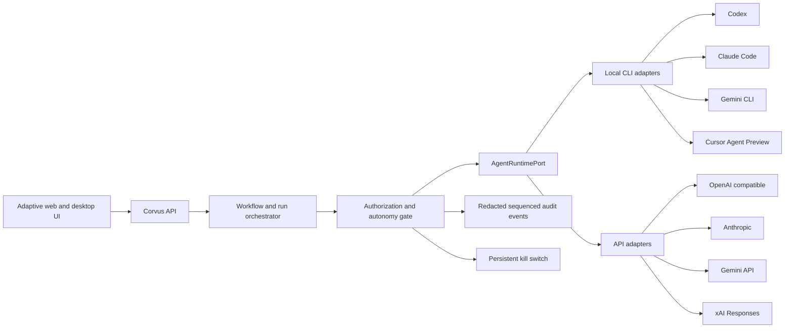

# Corvus Agent Runtime and Unattended UX — Decision-Ready Implementation Plan

Status: proposed; implementation is blocked on the five confirmations in `QUESTIONS.md`.

Date: 2026-07-15

## Outcome

Corvus should let a person connect a supported AI through an installed local agent or an API credential, choose how much work may proceed unattended, and receive a durable return summary. The implementation must use the authoritative Corvus authority boundary rather than delegating trust decisions to a vendor CLI.

This plan does not authorize provider-runtime code. It removes technical ambiguity so implementation can start test-first immediately after the product decisions are confirmed.

## Non-Negotiable Invariants

- A vendor's "YOLO", force, danger, or permission-bypass option is never a Corvus autonomy mode.
- Every effect is bound to current workspace/project authority, credential grant, budget, autonomy grant, kill-switch proof, and idempotency key.
- Local login state is consumed only through the vendor's supported executable. Corvus never copies browser cookies, OAuth tokens, or session files.
- API credentials remain in the OS keyring or another approved secret broker. UI, storage, events, audit records, and exceptions contain only opaque references.
- Executables are resolved to an absolute path, identity-checked, and launched with a minimal environment. Cancellation terminates the complete process tree.
- Tool output and provider output are untrusted external content until normalized and passed through the context firewall.
- Provider fallback is visible and opt-in because it can change data residency, cost, tools, model behavior, and privacy.
- Cloud remains Preview until the native selector, Google identity, E2B lifecycle, and real remote control path exist.
- Team selection grants no authority until shared membership/capability storage is implemented.

## Decisions Required

| Decision | Recommended default | Why |
| --- | --- | --- |
| Provider priority | Explicit workspace default; detected local tools shown first | Predictable cost and data flow without silent routing |
| Cursor semantics | Later `cursor-agent` adapter; no IDE-only fake connection | One runtime contract and auditable execution |
| Grok semantics | xAI Responses API | No supported local Grok CLI is installed; xAI recommends Responses |
| Unattended envelope | Repository-local read/write/test only | Useful automation without external or destructive authority |
| Milestone order | Agent runtime before Google/E2B | Matches the newly requested Local/API execution path; requires confirmation because it changes the approved sequence |

## Target Architecture

`ModelProviderClient` remains the narrow text-inference interface. Agentic execution receives a separate port so tool-bearing runs cannot accidentally inherit the weaker `ModelRequest` contract.

## Typed Contract

### ProviderBinding

- `id`, `workspace_id`, and optional `project_id`
- `family`: `codex | claude | gemini | cursor | xai | openai | anthropic | openrouter | ollama | openai_compatible`
- `transport`: `local_cli | http_api`
- `status`: `available | needs_login | unavailable | preview | unhealthy`
- exactly one of `executable_identity` or `credential_ref`
- `model`, `capabilities`, `health_checked_at`, and `version`
- explicit data-egress and server-storage disclosures

### AgentCapabilities

- text, structured output, streaming, images, tools, repository read/write, shell, MCP, session resume, usage/cost reporting, provider-side budget, and provider-side cancellation
- each capability is `supported | unsupported | unverified`; unverified capabilities are never enabled

### AutonomyGrant

- profile: `review_first | auto_within_limits | full_auto_while_away`
- allowed repositories and canonical path roots
- allowed tool/effect classes and denied classes
- network destinations and credential grants
- wall-clock deadline, provider spend ceiling, Corvus budget ceiling, turn/output limits, and retry ceiling
- approval ceiling and immutable always-block effects
- notification/return-summary policy
- issued-by principal, issue/expiry time, policy digest, and revocation state

### AgentRunRequest

- run/workspace/project/workflow/work-item IDs
- provider binding and model/effort
- prompt/messages plus untrusted context references
- authorization snapshot, autonomy grant, credential grant, budget snapshot, and kill-switch proof references
- sandbox profile and explicit filesystem/network/tool envelopes
- deadline, output limits, idempotency key, and optional safe resume handle

### AgentRunEvent

- monotonically increasing sequence number and timestamp
- `started | message_delta | tool_requested | tool_blocked | tool_started | tool_result | usage | approval_required | checkpoint | completed | failed | cancelled`
- redacted payload, provider event ID, run ID, and previous-event digest
- tool/effect events carry the Corvus authorization decision reference

### AgentRuntimePort

- `discover() -> tuple[ProviderCandidate, ...]`
- `capabilities(binding) -> AgentCapabilities`
- `health(binding) -> ProviderHealth`
- `start(request) -> AgentRunHandle`
- `events(handle, after_sequence) -> AsyncIterator[AgentRunEvent]`
- `cancel(handle, current_kill_switch_proof) -> CancellationResult`
- `resume(handle, request_with_fresh_proofs) -> AgentRunHandle`

## Adapter Safety Profiles

### Codex CLI

- Use structured JSONL output and an explicit working root.
- Use only `read-only` or `workspace-write` sandbox modes selected from the Corvus envelope.
- Preserve executable identity/hash checks, clean child environment, byte/time limits, and process-tree termination already implemented in `corvus/codex_cli.py`.
- Never use `--dangerously-bypass-approvals-and-sandbox`, `--dangerously-bypass-hook-trust`, or `danger-full-access`.
- Agentic support remains disabled until tool/effect events can be mapped to Corvus authorization before execution.

### Claude Code

- Use print mode with `stream-json`, a fixed session ID, explicit tools, disallowed tools, maximum turns, and maximum provider budget.
- Use `dontAsk` for unattended operation so anything not pre-authorized is denied rather than prompting indefinitely.
- Use the Corvus permission-prompt bridge only if every approval is bound to a current authorization snapshot and auditable effect.
- Never use `bypassPermissions`, `--dangerously-skip-permissions`, or the flag that enables that bypass.

### Gemini CLI

- Start with headless structured output in `plan` mode or text-only operation.
- Add edit/tool support only after policy-engine conformance tests prove allow/deny behavior in non-interactive mode.
- Pass an explicit Corvus-generated policy path; do not rely on ambient project policy.
- Never use `--yolo` or approval mode `yolo`.
- Treat `ask_user` as a deny in headless mode and surface it as a queued Corvus approval.

### Cursor Agent

- Keep Preview while `cursor-agent` is absent.
- When installed, detect/version/authenticate through supported CLI commands and consume structured output.
- Do not enable mutation through `--force` until Cursor permission rules and Corvus pre-execution authorization are proven equivalent for every enabled tool.
- Opening the IDE may be offered separately as a convenience, never represented as a runtime connection.

### xAI / Grok API

- Use the xAI Responses API with `https://api.x.ai/v1` and an opaque `XAI_API_KEY` credential reference.
- Set provider-side storage explicitly to off by default where supported; Corvus owns continuity unless the user opts into provider storage.
- Keep server-side tools disabled until they have Corvus effect mappings, cost limits, and data-egress disclosures.
- Use bounded streaming, SSRF-safe fixed endpoints, response-size limits, deadlines, and redaction already expected of Corvus HTTP providers.

## Streamlined UX

### Connection Setup

Replace the generic provider/reference form with an **AI connections** flow:

1. `On this computer` shows detected applications, version, login state, verified capabilities, and a truthful unavailable/Preview reason.
2. `With an API key` shows supported providers, keyring storage disclosure, a masked one-time entry field, model discovery, and a connection test.
3. Advanced users may enter an opaque credential reference; this is collapsed by default.
4. Workspace default and optional ordered fallback are selected explicitly.

Never render raw credentials after submission. Connection tests use a bounded health request and cannot mutate a workspace.

### Run Setup

Use one progressive flow:

1. **What should Corvus accomplish?** Goal first; success criteria optional.
2. **Who should run it?** Selected AI connection with a clear local/API badge.
3. **How independently?** Review first, Auto within limits, or Full auto while away.
4. **Review boundaries.** Paths, tools, network, time, spend, approval ceiling, stop conditions, and notifications.
5. **Start.** A compact summary with expandable expert policy details.

### Persona Composition

- Everyday/Personal: Home, My Work, Automations, and Settings. Connections live in Settings; results and blocked decisions lead.
- Developer/Personal: Repositories, Threads, Changes, Runs, and Connections. Diffs, logs, policies, and event streams remain first-class.
- Everyday/Team: shared work and people remain Preview until real membership exists.
- Developer/Team: agents, approvals, audit, and administration remain capability-gated until multi-user authority exists.

Split the overloaded Operations/Skills surface into Connections, Knowledge, Automations, and Ingress modules. Preserve deep links and current project context.

### Return Summary

An unattended run returns:

- completed outcome and acceptance results
- changed files/artifacts with diffs
- tests/checks and failures
- approvals that blocked or were consumed
- queued out-of-envelope work
- elapsed time, provider/model, token/cost and Corvus budget usage
- security events, stop reason, audit link, and resume/retry actions

## Delivery Milestones

Each milestone is test-first, updates `PROJECT_LOG.md`/`HACKATHON_STATUS.md`, receives a dedicated commit, and is pushed safely to GitHub `main` only after verification.

### M2A — Runtime Contract and Simulator

- Add typed domain contracts and `AgentRuntimePort` without wiring a live provider.
- Build deterministic fake runtime/event streams.
- Bind start/resume/cancel to authority, autonomy, credential, budget, kill-switch, and idempotency proofs.
- Gate: unit/property/security tests prove substitution, replay, stale-proof, over-budget, and killed-run denial.

### M2B — Discovery and AI Connections UX

- Add safe executable discovery/version/auth-state probes and API credential setup through the secret broker.
- Add capability-honest connection API and adaptive UI.
- Decompose the overloaded operations screen and fix mobile touch targets.
- Gate: no credential/token in response bodies, DOM, local/session storage, logs, crash output, or audit payloads.

### M2C — Codex Agent Runtime

- Extend the existing Codex foundation through `AgentRuntimePort`.
- Start read-only; enable workspace writes only after tool/effect interception tests pass.
- Gate: JSONL corruption, timeout, cancellation, executable swap, poisoned PATH, oversized output, and orphan-process tests.

### M2D — Claude and Gemini Local Runtimes

- Implement Claude structured streaming with explicit permission/tool/turn/budget controls.
- Implement Gemini plan/text mode, then policy-conformant edit support.
- Gate: vendor policy cannot broaden the Corvus envelope; unsupported capability stays disabled.

### M2E — API Providers and xAI

- Unify keyring credentials behind authoritative credential references.
- Add xAI Responses and normalize existing OpenAI/Anthropic/Gemini/OpenRouter/Ollama connections.
- Gate: SSRF/DNS pinning, bounded streams, provider storage disclosure, cancellation, rate-limit/error normalization, and cost accounting.

### M2F — Bounded Unattended Operation

- Add the three autonomy profiles, pre-run boundary summary, persistent kill control, checkpoints, blocked queue, and return summary.
- Gate: unattended work cannot exceed path/tool/network/time/cost/approval ceilings; restart recovery is durable and idempotent.

### M2G — Cursor Preview Adapter

- Implement only after the supported CLI is installed and its permission contract passes conformance tests.
- Otherwise retain truthful installation guidance and Preview status.

### Sequence Boundary

After M2G, return to the approved native Local/Cloud chooser, Google identity, and E2B lifecycle milestone unless the user confirms a different sequence. Do not begin multi-user database/collaboration changes without the existing explicit authorization.

## Verification Matrix

### Unit and Contract

- strict model validation and capability downgrade behavior
- event ordering, duplicate/replay rejection, and digest continuity
- stale/missing/substituted authority, credential, budget, autonomy, or kill proofs
- cancellation races, crash recovery, retry ceilings, and idempotent resume
- provider error, usage, cost, and redaction normalization

### Adapter Conformance

- fake executables for every exit code and malformed/truncated/oversized stream
- executable identity change between discovery and launch
- PATH/shim target mutation and minimal environment verification
- provider login missing/expired and version below supported range
- timeout and whole-process-tree termination with no orphan
- blocked tools never execute, even if vendor configuration is more permissive

### API and Security

- CSRF/session/project authority on every mutation
- secret accepted once, stored in keyring, returned only as opaque reference
- no secret in DOM, storage, logs, events, exceptions, audit, screenshots, or support bundle
- SSRF, DNS rebinding, redirect, response limit, and certificate failures
- kill switch pre-start, mid-stream, during approval, during retry, and after restart

### Web Playwright

- onboarding and connection setup across four workspace profiles
- detected/needs-login/unavailable/Preview/API-key states
- progressive run setup and all autonomy profiles
- approval queue, budget exhaustion, kill, crash/reload, SSE loss/recovery, and return summary
- provider fallback disclosure and opt-in
- 390×844 mobile flow without overflow; minimum 44px primary touch targets
- keyboard, focus restoration, live regions, reduced motion, and contrast

### Windows Computer Use

- desktop first launch and local sidecar pairing
- real installed-provider detection and supported login failures
- start, interrupt, close/reopen, recover, kill, and verify no orphan process
- 100%, 125%, 150%, and 200% display scaling
- unattended run interruption and return-summary comprehension
- Cloud remains truthful Preview and cannot trigger auth/payment/E2B requests

### Certification

- full Python, type, lint, format, web, Rust, dependency, packaging, and security suites
- GitHub certification green on Windows, macOS, Linux, and Docker sandbox
- clean worktree and remote `main` exactly matching the verified commit

## Planned File Boundaries

- `corvus/domain/agent_runtime.py` — strict provider, capability, grant, request, handle, event, and result models.
- `corvus/application/agent_runtime.py` — authorization-bound orchestration and idempotent lifecycle.
- `corvus/application/ports.py` — `AgentRuntimePort` protocol.
- `corvus/infrastructure/agent_runtimes/` — CLI/API discovery and adapters.
- `corvus/mvp/api.py` and generated OpenAPI types — thin connection/run endpoints.
- `apps/web/src/connections/` — connection discovery/setup/status.
- `apps/web/src/runs/` — progressive setup, boundary review, live status, and return summary.
- `apps/web/src/operations/` — Connections, Knowledge, Automations, and Ingress route decomposition.
- corresponding unit, contract, integration, security, Playwright, packaging, and native QA tests.

## Source Notes

- Installed CLI `--help` output collected locally on 2026-07-15 for Codex 0.144.0, Claude Code 2.1.209, and Gemini CLI 0.44.1.
- Claude CLI reference: <https://code.claude.com/docs/en/cli-usage>
- Gemini headless reference: <https://geminicli.com/docs/cli/headless/>
- Gemini policy engine: <https://geminicli.com/docs/reference/policy-engine/>
- Cursor headless CLI: <https://docs.cursor.com/en/cli/headless>
- Cursor permissions: <https://docs.cursor.com/cli/reference/permissions>
- xAI Responses comparison: <https://docs.x.ai/developers/model-capabilities/text/comparison>
